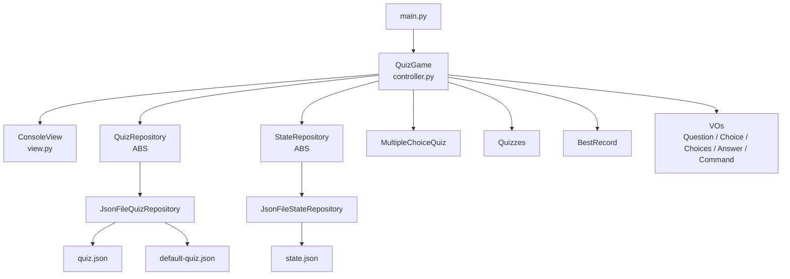
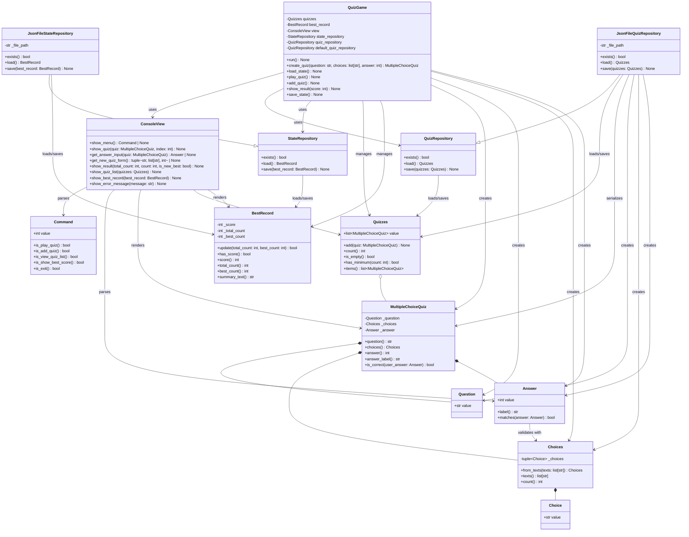
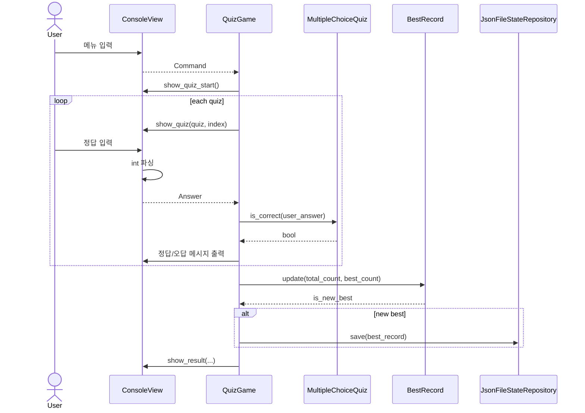
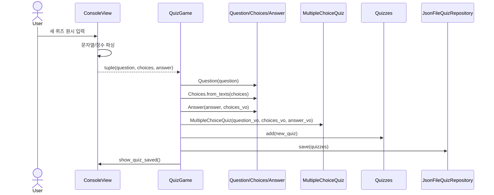

# UML

이 문서는 현재 퀴즈 게임의 구조를 UML 관점에서 정리한 문서입니다.  
Mermaid를 지원하는 Markdown 뷰어에서 다이어그램을 바로 볼 수 있습니다.

## Layer Diagram

## Class Diagram

## Sequence Diagram

### Quiz Solve Flow

### Add Quiz Flow

## Notes

- `QuizGame`은 흐름 제어자이고, 입력/출력과 저장 포맷을 직접 다루지 않습니다.
- `QuizGame`은 `QuizRepository`, `StateRepository` 추상 타입에 의존하고, 실제 파일 저장은 JSON 구현체가 담당합니다.
- `ConsoleView`는 원시 입력을 파싱하지만, 정답 범위 같은 도메인 규칙은 `Answer`가 검증합니다.
- `MultipleChoiceQuiz`는 원시 문자열/숫자 묶음이 아니라 `Question`, `Choices`, `Answer`의 조합입니다.
- `Quizzes`는 퀴즈 목록을 감싸는 일급 컬렉션입니다.
- `BestRecord`는 최고 점수 계산과 갱신 규칙을 객체 내부에 캡슐화합니다.
